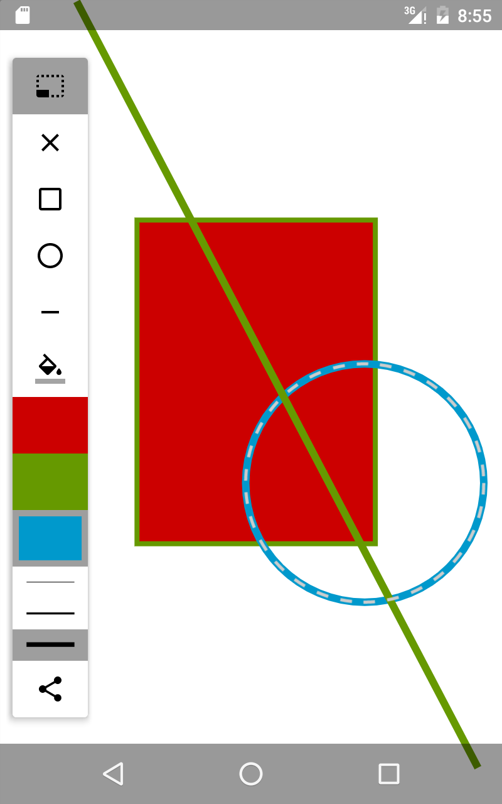

# JSketch (Android)

A very simple drawing application for Android devices. Allows users to draw rectangles, lines, circles of varying thicknesses and colours. Also supports moving shapes around, and saving the canvas and sharing it. 

This was my submission University of Waterloo's CS349 (User Interfaces) assignment 3. 

## Screenshots

## Running 

Import the project into Android Studio and deploy to a device.

## Icons

The icons used for the tools are the material design icons produced by google. See https://design.google.com/icons/ for the icons. The icons are licensed under Creative Commons Attribution 4.0 International License (CC-BY 4.0) (http://creativecommons.org/licenses/by/4.0/)
